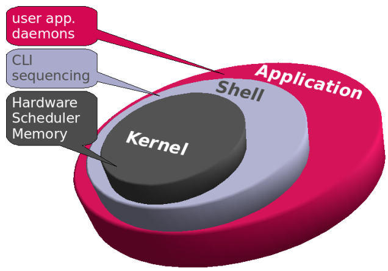
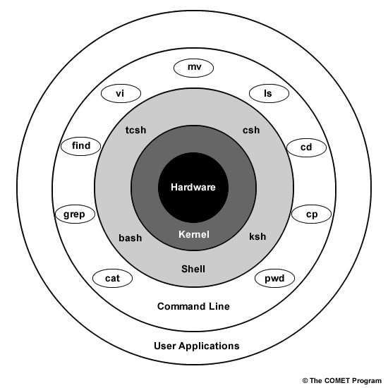
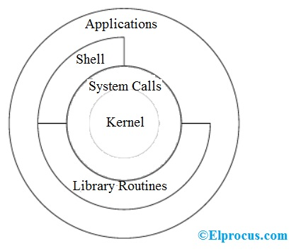

# notes on bash

Maybe the best intro to bash would be a practical demonstration showing how to
execute some task that's important to you right now.  For example, copying files
or creating an ssh key-pair for securely connection to a remote machine.  With
that context, learning the general ideas and technologies involved would be
well-motivated.

One can become overwhelmed with all of the documentation and resources to get
familiar with bash, so, as with any complicated topic, it's probably best to
take an iterative approach to learning.

Here I'll try to give a broad overview of what bash is and how to learn more
about it, with emphasis on it's own commands, tools, and self-documentation.

## GNU

Bash is a part of the
[GNU](https://www.gnu.org/software/software.html)/[Linux](https://en.wikipedia.org/wiki/Linux)
operating system, although it's available in Apple (MacOS) and Microsoft
(Windows) systems too.  It's full name is
[GNU Bash](https://www.gnu.org/software/bash/), where the name "Bash" stands for
"the Bourne Again SHell" - a pun derived from an earlier shell called the Bourne
Shell.

## A shell

To get an idea of what a
[shell](https://en.wikipedia.org/wiki/Shell_(computing)) is and what role it
plays in an operating system, especially with respect to the
[kernel](https://en.wikipedia.org/wiki/Kernel_(operating_system)), here are
some simplified diagrams, hopefully giving a useful first-iteration
perspective, even if they're a little over-simplified.

## A scripting language

## Commands

