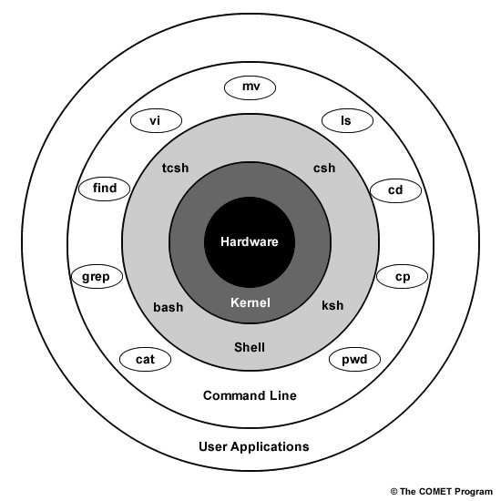

# notes on bash

## General Reference

* [bash on Wikipedia](https://en.wikipedia.org/wiki/Bash_(Unix_shell))
* [official bash site](https://www.gnu.org/software/bash/)
* [bash manual options](https://www.gnu.org/software/bash/manual)
* [reference manual](https://www.gnu.org/software/bash/manual/bash.html)

## Intro

Bash is a powerful tool to interact with and control a computer.

Maybe the best intro to bash would be a practical demonstration showing how to
execute some task that's important to you right now.  For example, copying files
or creating an ssh key-pair for securely connection to a remote machine.  With
that context, learning the general ideas and technologies involved would be
well-motivated.

One can become overwhelmed with all of the documentation and resources to get
familiar with bash, so, as with any complicated topic, it's probably best to
take an iterative approach to learning.

Here I'll try to give a broad overview of what bash is and how to learn more
about it, with emphasis on it's own commands, tools, and self-documentation.

## GNU

Bash is a part of the
[GNU](https://www.gnu.org/software/software.html)/[Linux](https://en.wikipedia.org/wiki/Linux)
operating system, although it's available in Apple (MacOS) and Microsoft
(Windows) systems too.  It's full name is
[GNU Bash](https://www.gnu.org/software/bash/), where the name "Bash" stands for
"the Bourne Again SHell" - a pun derived from an earlier shell called the Bourne
Shell.

## Shell

"Bash" is a [shell](https://en.wikipedia.org/wiki/Shell_(computing)) and its
associated ("scripting") language.  A shell is a computer program that gives a
user access to and control of the computer at a fairly deep level.  To get an
idea of what a shell is and what role it plays in an operating system,
especially with respect to the
[kernel](https://en.wikipedia.org/wiki/Kernel_(operating_system)), here are some
simplified diagrams, hopefully giving a useful first-iteration perspective, even
if they're a little over-simplified.

Test:

A shell is a program that provides commands and a language/syntax to chain the
commands together, as a means to interacting with a computer.  (Due to that
chaining ability, a command can be simple or compound.)

Usually a user accesses a shell through a physical terminal (keyboard and
screen) and/or a "virtual terminal" (a graphical user interface, or GUI,
application accessible through the GUI portion of an operating system).  One
can thus say that one usually uses a virtual terminal that is "powered by" a
specific shell.  The shell and terminal are also called a command-line
interface or CLI, since commands are (usually) entered interactively one line at
a time, with each new line starting with a "prompt" or symbol to indicate that
the shell is awaiting a new command.

Bash is a shell, but there are many other shells, such as sh (the Thompson
shell and then the Bourne Shell), csh (the C shell), tcsh (the TENEX C shell),
ksh (the Korn shell), zsh (the Z Shell), fish (the friendly interactive shell),
rc (run commands), ash, es, dash, sash, the Microsoft Powershell, etc.  Here are
some [shell comparisons](https://hyperpolyglot.org/unix-shells).

## Scripting language

A shell program comes along with its own built-in commands and its own
programming language or scripting language.  This allows a person to construct
compound commands from the built-in commands, and construct large sequences of
commands that can be saved in a file (a "script") and executed. A script can
run interactively (requiring intervention from a user to continue) or in "batch"
form (executing the commands in a single-shot and requiring no user input while
it runs).

The language allows use of "utilities" or commands/programs that are called in
the shell and trigger processes that may be based upon the language's
fundamental built-in commands or may use other languages to operate.

So "bash", besides referring to the shell program, can also refer specifically
to the scripting language that the bash shell uses.

## Bash Commands

### orientation

Here are some important orienting bash commands:

<!-- markdownlint-disable MD033 -->
<table>
 <thead>
  <tr>
    <td>Command</td>
    <td>
      Example Usage 
      <code>&#x2011;&#x2011;&#x2011;&#x2011;&#x2011;&#x2011;&#x2011;&#x2011;&#x2011;&#x2011;&#x2011;&#x2011;&#x2011;&#x2011;&#x2011;&#x2011;&#x2011;&#x2011;</code>
    </td>
    <td>Notes</td>
  </tr>
 </thead>
 <tbody>
  <tr>
    <td><code>help</code></td>
    <td>
      <code>help</code> 
      <code>help help</code> 
      <code>help cd</code> 
      <code>help compgen</code>
    </td>
    <td>
      <code>help [built-in command]</code> 
      See GNU bash help info, including further suggested help commands and a
      bash built-in commands list.  Notice that the <code>help cd</code> output
      explains the options/flags for the command <code>cd</code>, but
      <code>help compgen</code> does not explain the options for
      <code>compgen</code>.  For that explanation we'll have to explore
      <code>info bash</code> or search online (on the internet).
    </td>
  </tr>
  <tr>
    <td><code>info</code></td>
    <td>
      <code>info</code> 
      <code>info info</code> 
      <code>info bash</code> 
    </td>
    <td>
      "Info reader" 
      Start with <code>info info</code> to learn how to use it.
    </td>
  </tr>
  <tr>
    <td><code>man</code></td>
    <td>
      <code>man man</code> 
      <code>man info</code> 
      <code>man bash</code> 
      <code>man ls</code>
    </td>
    <td>
      <code>man [command]</code> 
      Access a manual page for the command <code>[command]</code>.
    </td>
  </tr>
  <tr>
    <td><code>apropos</code></td>
    <td>
      <code>apropos networking</code> 
      <code>apropos time</code>
    </td>
    <td>
      <code>apropos [string]</code> 
      Search to see what commands have <code>[string]</code> in their
      descriptions and might be appropriate/apropos for actions related to
      <code>[string]</code>. 
      EG: <code>apropos 'configure network'</code> 
      Note: <code>man -k</code> is equivalent to <code>apropos</code>.
    </td>
  </tr>
  <tr>
    <td><code>bash</code></td>
    <td>
      <code>bash</code> 
      <code>bash --help</code> 
      <code>bash [filename]</code>
    </td>
    <td>
      Bash shell execution.  Executing <code>bash</code> by itself starts a new
      shell, where you can execute <code>exit</code> to close that new shell,
      bringing you back to the original shell you started with.  If a file such
      as <code>file.bash</code> contains a valid bash script, then executing
      <code>bash file.bash</code> will execute that whole bash script.
    </td>
  </tr>
 </tbody>
</table>
<!-- markdownlint-enable MD033 -->

### common

Here are some commonly used commands and key-combinations:

`cd`, `ls`, `cp`, `mv`, `rm`, `touch`, `grep`, `find`

(Control-C): to cancel a command/process that is currently running.

`sudo` (super-user do), `exit` (Control-D), `shutdown`, `reboot`

`chown`, `chmod`

### package management

It will be important to learn about which package manager your operating system
uses, if any.  (For example, `apt`.)  (Note to self: I want to mention more
useful orienting commands, such as `hostnamectl`, which might not be included
by default but can be installed.  Also, `uname`, `whoami`, `tree`, etc.)

## More Links

Beginners?:

* [guide for beginners](http://tldp.org/LDP/Bash-Beginners-Guide/html/index.html)

Scripting:

* [bash scripting tutorial](https://linuxconfig.org/bash-scripting-tutorial-for-beginners)
* [really nice scripting reference](https://devhints.io/bash)

System Admin:

* [SysAdmin Basics](https://www.linode.com/docs/tools-reference/linux-system-administration-basics/)
* [SysAdmin Tutorial](https://www.tutorialspoint.com/linux_admin/)
